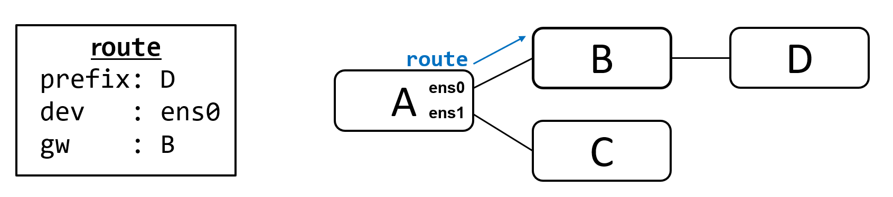
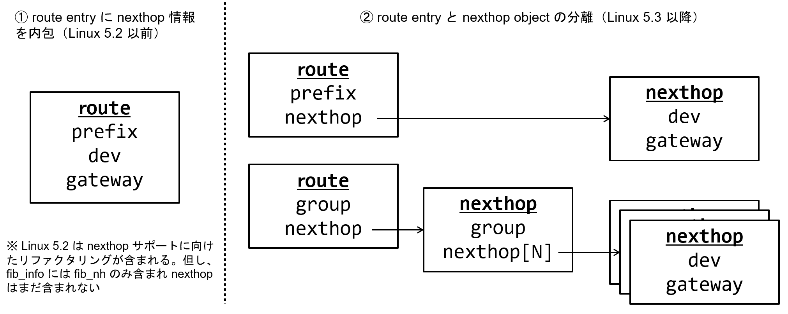

# Linux IP Routing

> 特に言及がない場合は Linux v6.0 をベースに解説しています
 
Linux では IP packet を送信する際に Fib (Forwarding Information Base) と呼ばれるテーブルを参照し、宛先アドレスから送信先を検索します。
FibやFibに関連するデータ構造はバージョン毎に変化を続けていますが、中でも Linux v5.3 から導入された Next Hop Object による変更は大きなものです。
本ページでは、Linux における Fib についての解説を、大きな変更点などを含めて解説します。

- [TODO](#todo)
- [Route Table](#route-table)
- [Route Entry \& Next Hop のデータ構造](#route-entry--next-hop-のデータ構造)
- [fib\_info \& Next Hop Object (Linux Source Code)](#fib_info--next-hop-object-linux-source-code)
- [Next Hop Group (nh\_group)](#next-hop-group-nh_group)
- [Next Hop Group の設定方法](#next-hop-group-の設定方法)
- [memo: Linux Kernel Source Code snippet](#memo-linux-kernel-source-code-snippet)

## TODO

- IPv6 に関しても調査。特に Linux v5.1/v5.2/v5.3 での fib6_info を中心とした変更（リファクタリング）など

## Route Table

- Reference
  - [Guide to IP Layer Network Administration with Linux | 4.8. Routing Tables](http://linux-ip.net/html/routing-tables.html) 

Linux では複数の Route Table が存在し、 `cat /etc/iproute2/rt_tables` で一覧を参照可能です。
以下 ID は予約されています。

- 255     local ... Kernelが管理し、通常は見えなくなっている
- 254     main ... Table ID を指定せず route を追加した場合追加されるテーブル
- 253     default
- 0       unspec


## Route Entry & Next Hop のデータ構造

Route Entry とは宛先に到達するために必要な情報を持ち、一般的に宛先（prefix/len）に対応した転送先情報 gateway (gw) と device (dev) を保持します。

実装により様々な保持の仕方（データ構造）が存在しますが、ここでは Linux ではどのようなデータ構造となっているのかを見ていきましょう。

> - この場合の prefix は Longest Prefix Match に利用されマスク（len）を含みます）
> - Linuxを含め、gw/dev 以外にも様々な情報を保持する実装が多いですが、ここでは省略します。

図：Route Entry の概念図


Linux 5.2 以前と、Linux 5.3 以降でデータ構造に変更がありました。
具体的には、以下図の右側のように、Linux 5.3 で Next Hop に関する情報が Route Entry から分離されました。

これにより、以下のようなメリットが得られました。

- 追加・更新に必要な時間の短縮
  - Next Hop が無い場合、Route追加時に以下操作が毎回必要となる
    - gateway address + dev が正しいかの確認（Lookup）
    - トンネルインターフェースの場合、状態の確認
    - Next Hop の比較・検索（既に存在するか？新規か？）
  - Next Hop Group が無い場合、Next Hop 追加・変更・削除時に、全ての route エントリの更新が必要
- リソース（メモリ・SRAM/TCAM）の節約
  - 共通の Net Hop を持つ複数の Route Entry が Next Hop を共有可能

図：Linux の Route Entry 及び Next Hop Object の概念図


## fib_info & Next Hop Object (Linux Source Code)

Linux Kernel の Source Code ではどのように定義されているか確認しましょう。

Linux ではルーティングエントリは `ip_fib.h` に定義された `fib_info` に保持されます。
（IPv6の場合は `ip6_fib.h` に定義された `fib6_info`）

Linux 5.2 までは `fib_info` の `fib_nh` という構造体に nexthop (dev/gw) に関する情報は保持されていますが、Linux 5.3 では `nexthop` が追加されているのが確認できます。

Linux 5.3 で `nexthop` があれば `fib_nh` は不要ですが、`fib_nh` と `nexthop` の両方がある事により、Linux 5.2 までのデータ構造を想定したコードと新しいコードが並存する事が可能となっています。

> linux-5.2/include/net/ip_fib.h 
```c
struct fib_info {
...
    int         fib_nhs;
    bool            fib_nh_is_v6;
    struct rcu_head     rcu;
    struct fib_nh       fib_nh[0];
#define fib_dev     fib_nh[0].fib_nh_dev
};
```


> linux-5.3/include/net/ip_fib.h
```c
struct fib_info {
...
    int         fib_nhs;
    bool            fib_nh_is_v6;
    bool            nh_updated;
    struct nexthop      *nh;
    struct rcu_head     rcu;
    struct fib_nh       fib_nh[0];
};
```

`nexthop` 構造体は以下のように `nexthop` -> `nh_info` -> `fib_nh_common` 構造体で dev/gw の情報を保持しています。

> linux-5.3/include/net/nexthop.h
```c
struct nexthop {
...
    union {
        struct nh_info  __rcu *nh_info;
        struct nh_group __rcu *nh_grp;
    };
};

struct nh_info {
...
    u8          family;
...
    union {
        struct fib_nh_common    fib_nhc;
        struct fib_nh       fib_nh;
        struct fib6_nh      fib6_nh;
    };
};
```

> linux-5.3/include/net/ip_fib.h
```c
struct fib_nh_common {
...
    struct net_device   *nhc_dev;
    int         nhc_oif;
    unsigned char       nhc_scope;
    u8          nhc_family;
    u8          nhc_gw_family;
    unsigned char       nhc_flags;
    struct lwtunnel_state   *nhc_lwtstate;

    union {
        __be32          ipv4;
        struct in6_addr ipv6;
    } nhc_gw;
...
};
```

## Next Hop Group (nh_group)

`nexthop` 構造体には、`nh_info` と `nh_group` が `union` で定義されていました。
`nh_info` ではなく `nh_group` を用いる事により Next Hop が複数ある状態である Multi Path を定義できます。

具体的には、`nexthop` -> `nh_group` -> `nh_group_entry` -> `nexthop` -> `nh_info` と定義します。
通常 `nh_group_entry` は２つ以上となります。

> linux-5.3/include/net/nexthop.h
```c
struct nexthop {
...
    union {
        struct nh_info  __rcu *nh_info;
        struct nh_group __rcu *nh_grp;
    };
};
```

> linux-5.3/include/net/nexthop.h
```c
struct nh_group {
    u16         num_nh;
    bool            mpath;
    bool            has_v4;
    struct nh_grp_entry nh_entries[0];
};

struct nh_grp_entry {
    struct nexthop  *nh;
    u8      weight;
    atomic_t    upper_bound;

    struct list_head nh_list;
    struct nexthop  *nh_parent;  /* nexthop of group with this entry */
};
```

## Next Hop Group の設定方法

> iproute2 のバージョンに注意

ip コマンド（iproute2）を用いる事により、nexthop group を用いた (ECMP含む) Multi Path を設定できます。
具体的には、以下手順となります。

- nexthop を追加
- nexthop group を追加
- route を追加（nexthop group の id を Next Hop として指定）

`ip nexthop list` コマンドにより、nexthop が作成されていることが確認できます。

```
> more on `man ip nexthop`
> make sure your iproute2 supports nexthop
$ ip -V
ip utility, iproute2-ss200127

$ ip ne [tab]
neigh    netconf  netns    nexthop

> Adds a nexthop group with id 3 using nexthops
> with ids 1 and 2 at equal weight.

ip nexthop add id 1 via 172.20.105.172 dev eno1
ip nexthop add id 2 via 172.20.105.173 dev eno1
ip nexthop add id 3 group 1/2

$ ip nexthop list
id 1 via 172.20.105.172 dev eno1 scope link
id 2 via 172.20.105.173 dev eno1 scope link
id 3 group 1/2

$ ip route add 10.99.99.99/32 nhid 3

$ ip route
10.99.99.99 nhid 3
        nexthop via 172.20.105.172 dev eno1 weight 1
        nexthop via 172.20.105.173 dev eno1 weight 1
```

なお、従来の方法である Next Hop Group を利用せず Multi Path を設定する事も可能です。
（Linux v5.2 以前の設定方法）

この場合、`fib_info` では `struct nexthop *nh;` ではなく `struct fib_nh fib_nh[0];` が利用されます。
`ip nexthop list` コマンドにより、nexthop が作成されて**いない**ことが確認できます。

```
> If you do not use nexthop id, then it will be
> configured in legacy way (non-nexthop object)

$ ip route add 10.11.11.11/32 \
    nexthop via 172.20.105.174 dev eno1 \
    nexthop via 172.20.105.175 dev eno1

$ ip route
default via 172.20.104.1 dev eno1 proto static
10.11.11.11
        nexthop via 172.20.105.174 dev eno1 weight 1
        nexthop via 172.20.105.175 dev eno1 weight 1
10.99.99.99 nhid 3
        nexthop via 172.20.105.172 dev eno1 weight 1
        nexthop via 172.20.105.173 dev eno1 weight 1

> Make sure gateways defined using nexthop are only shown

$ ip nexthop list
id 1 via 172.20.105.172 dev eno1 scope link
id 2 via 172.20.105.173 dev eno1 scope link
id 3 group 1/2
```

## memo: Linux Kernel Source Code snippet

> linux-5.2/include/net/ip_fib.h
```c
struct fib_info {
    struct hlist_node   fib_hash;
    struct hlist_node   fib_lhash;
    struct net      *fib_net;
    int         fib_treeref;
    refcount_t      fib_clntref;
    unsigned int        fib_flags;
    unsigned char       fib_dead;
    unsigned char       fib_protocol;
    unsigned char       fib_scope;
    unsigned char       fib_type;
    __be32          fib_prefsrc;
    u32         fib_tb_id;
    u32         fib_priority;
    struct dst_metrics  *fib_metrics;
#define fib_mtu fib_metrics->metrics[RTAX_MTU-1]
#define fib_window fib_metrics->metrics[RTAX_WINDOW-1]
#define fib_rtt fib_metrics->metrics[RTAX_RTT-1]
#define fib_advmss fib_metrics->metrics[RTAX_ADVMSS-1]
    int         fib_nhs;
    bool            fib_nh_is_v6;
    struct rcu_head     rcu;
    struct fib_nh       fib_nh[0];
#define fib_dev     fib_nh[0].fib_nh_dev
};
```

> linux-5.3/include/net/ip_fib.h
```c
struct fib_info {
    struct hlist_node   fib_hash;
    struct hlist_node   fib_lhash;
    struct list_head    nh_list;
    struct net      *fib_net;
    int         fib_treeref;
    refcount_t      fib_clntref;
    unsigned int        fib_flags;
    unsigned char       fib_dead;
    unsigned char       fib_protocol;
    unsigned char       fib_scope;
    unsigned char       fib_type;
    __be32          fib_prefsrc;
    u32         fib_tb_id;
    u32         fib_priority;
    struct dst_metrics  *fib_metrics;
#define fib_mtu fib_metrics->metrics[RTAX_MTU-1]
#define fib_window fib_metrics->metrics[RTAX_WINDOW-1]
#define fib_rtt fib_metrics->metrics[RTAX_RTT-1]
#define fib_advmss fib_metrics->metrics[RTAX_ADVMSS-1]
    int         fib_nhs;
    bool            fib_nh_is_v6;
    bool            nh_updated;
    struct nexthop      *nh;
    struct rcu_head     rcu;
    struct fib_nh       fib_nh[0];
};
```

> linux-5.3/include/net/nexthop.h
```c
struct nexthop {
    struct rb_node      rb_node;    /* entry on netns rbtree */
    struct list_head    fi_list;    /* v4 entries using nh */
    struct list_head    f6i_list;   /* v6 entries using nh */
    struct list_head    grp_list;   /* nh group entries using this nh */
    struct net      *net;

    u32         id;

    u8          protocol;   /* app managing this nh */
    u8          nh_flags;
    bool            is_group;

    refcount_t      refcnt;
    struct rcu_head     rcu;

    union {
        struct nh_info  __rcu *nh_info;
        struct nh_group __rcu *nh_grp;
    };
};

struct nh_info {
    struct hlist_node   dev_hash;    /* entry on netns devhash */
    struct nexthop      *nh_parent;

    u8          family;
    bool            reject_nh;

    union {
        struct fib_nh_common    fib_nhc;
        struct fib_nh       fib_nh;
        struct fib6_nh      fib6_nh;
    };
};
```

> linux-5.3/include/net/ip_fib.h
```c
struct fib_nh_common {
    struct net_device   *nhc_dev;
    int         nhc_oif;
    unsigned char       nhc_scope;
    u8          nhc_family;
    u8          nhc_gw_family;
    unsigned char       nhc_flags;
    struct lwtunnel_state   *nhc_lwtstate;

    union {
        __be32          ipv4;
        struct in6_addr ipv6;
    } nhc_gw;

    int         nhc_weight;
    atomic_t        nhc_upper_bound;

    /* v4 specific, but allows fib6_nh with v4 routes */
    struct rtable __rcu * __percpu *nhc_pcpu_rth_output;
    struct rtable __rcu     *nhc_rth_input;
    struct fnhe_hash_bucket __rcu *nhc_exceptions;
};
```
