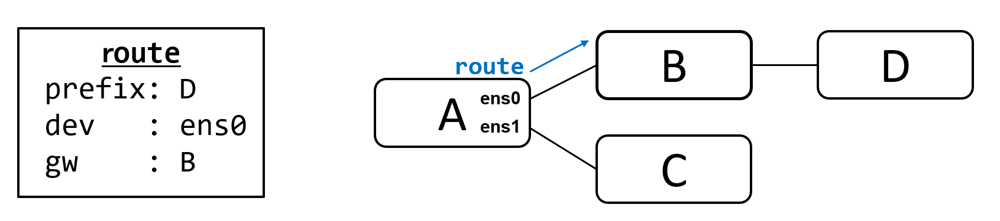
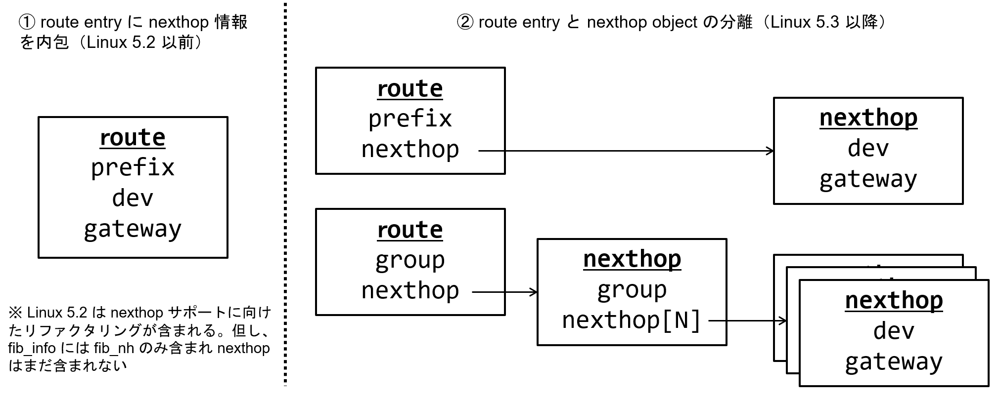

# netlink/rtnetlink - Next Hop Object & Next Hop Group

## netlink とは？

netlink とは、 Linux Kernel と情報のやり取りをするために利用されるインタフェース（API）、もしくはそれを提供するサブシステムです。
netlink は Socket を利用するため、TCP/UDP等の Socket プログラミングに馴染みある技術者であれば学習コストが少ないというメリットもあります。

netlink はプロトコル `protocol` と呼ばれる機能毎にグルーピングされます。
今回解説する IP Routing / Neighbor に関連した機能は `rtnetlink` と呼ばれ `protocol == NETLINK_ROUTE` という分類に所属します。

netlink を利用するためには、socket システムコール `int socket(int domain, int type, int protocol)` の第一引数に `AF_NETLINK` 、第二引数に `SOCK_RAW`、第三引数に `protocol` を指定します。

```
fd = socket(AF_NETLINK, SOCK_RAW, NETLINK_ROUTE);
```

## netlink/rtnetlink を学習するモチベーション

White Box Switch 等の上で動作する Network OS は、 netlinkを利用して様々な情報をホストOSや routing application （OSPF/ISIS/BGPの機能を提供するプロセスやコンテナ） から情報を受け取る場合も多く、Linux Server だけでなくスイッチやルータの実装を知るためにも重要な機能です。
例えば SONiC では、netlink を利用して Linux Kernel からポートやネイバーの情報を取得する他にも、FRR が動作する bgp container 内では FPM (Forwarding Plane Manager) との通信にも利用されています。

そのため、ネットワークに関連した幅広い技術者にとって学ぶべき基本的な技術と考えられます。


図：ネットリンクを活用している NOS の例  
（引用：Linux Plumbers Conf 2019: David Ahern: [nexthop-objects-talk.pdf](https://lpc.events/event/4/contributions/434/attachments/251/436/nexthop-objects-talk.pdf)）


## iproute2

rtnetlink を多用するツールとして iproute2 が挙げられます。
iproute2 の中の ip コマンドを用いて、netlink がどのように利用されているか見る事ができます。

例えば以下例では、netlink を用いて static route を追加しています。

- `sendmsg`
  - type=RTM_NEWROUTE
  - rtm_family=AF_INET, rtm_dst_len=32
  - {nla_len=8, nla_type=RTA_DST}, inet_addr("10.10.10.10")}
  - {nla_len=8, nla_type=RTA_GATEWAY}, inet_addr("172.20.105.174")

```
# strace ip route add 10.10.10.10/32 via 172.20.105.174 dev eno1
...
socket(AF_NETLINK, SOCK_RAW|SOCK_CLOEXEC, NETLINK_ROUTE) = 3
...
bind(3, {sa_family=AF_NETLINK, nl_pid=0, nl_groups=00000000}, 12) = 0
...
sendmsg(3, {msg_name={sa_family=AF_NETLINK, nl_pid=0, nl_groups=00000000}, msg_namelen=12, msg_iov=[{iov_base={{len=52, type=RTM_NEWROUTE, flags=NLM_F_REQUEST|NLM_F_ACK|NLM_F_EXCL|NLM_F_CREATE, seq=1669630667, pid=0}, {rtm_family=AF_INET, rtm_dst_len=32, rtm_src_len=0, rtm_tos=0, rtm_table=RT_TABLE_MAIN, rtm_protocol=RTPROT_BOOT, rtm_scope=RT_SCOPE_UNIVERSE, rtm_type=RTN_UNICAST, rtm_flags=0}, [{{nla_len=8, nla_type=RTA_DST}, inet_addr("10.10.10.10")}, {{nla_len=8, nla_type=RTA_GATEWAY}, inet_addr("172.20.105.174")}, {{nla_len=8, nla_type=RTA_OIF}, if_nametoindex("eno1")}]}, iov_len=52}], msg_iovlen=1, msg_controllen=0, msg_flags=0}, 0) = 52
```

## Route Entry & Next Hop のデータ構造

Route Entry とは宛先に到達するために必要な情報を持ち、一般的に宛先（prefix/len）に対応した転送先情報 gateway (gw) と device (dev) を保持します。

実装により様々な保持の仕方（データ構造）が存在しますが、ここでは Linux ではどのようなデータ構造となっているのかを見ていきましょう。

> - この場合の prefix は Longest Prefix Match に利用されマスク（len）を含みます）
> - Linuxを含め、gw/dev 以外にも様々な情報を保持する実装が多いですが、ここでは省略します。

図：Route Entry の概念図


Linux 5.2 以前と、Linux 5.3 以降でデータ構造に変更がありました。
具体的には、以下図の右側のように、Linux 5.3 で Next Hop に関する情報が Route Entry から分離されました。

これにより、以下のようなメリットが得られました。

- 追加・更新に必要な時間の短縮
  - Next Hop が無い場合、Route追加時に以下操作が毎回必要となる
    - gateway address + dev が正しいかの確認（Lookup）
    - トンネルインターフェースの場合、状態の確認
    - Next Hop の比較・検索（既に存在するか？新規か？）
  - Next Hop Group が無い場合、Next Hop 追加・変更・削除時に、全ての route エントリの更新が必要
- リソース（メモリ・SRAM/TCAM）の節約
  - 共通の Net Hop を持つ複数の Route Entry が Next Hop を共有可能

図：Linux の Route Entry 及び Next Hop Object の概念図


## fib_info & Next Hop Object (Linux Source Code)

Linux Kernel の Source Code ではどのように定義されているか確認しましょう。

Linux ではルーティングエントリは `ip_fib.h` に定義された `fib_info` に保持されます。
（IPv6の場合は `ip6_fib.h` に定義された `fib6_info`）

Linux 5.2 までは `fib_info` の `fib_nh` という構造体に nexthop (dev/gw) に関する情報は保持されていますが、Linux 5.3 では `nexthop` が追加されているのが確認できます。

Linux 5.3 で `nexthop` があれば `fib_nh` は不要ですが、`fib_nh` と `nexthop` の両方がある事により、Linux 5.2 までのデータ構造を想定したコードと新しいコードが並存する事が可能となっています。

> linux-5.2/include/net/ip_fib.h 
```c
struct fib_info {
...
    int         fib_nhs;
    bool            fib_nh_is_v6;
    struct rcu_head     rcu;
    struct fib_nh       fib_nh[0];
#define fib_dev     fib_nh[0].fib_nh_dev
};
```


> linux-5.3/include/net/ip_fib.h
```c
struct fib_info {
...
    int         fib_nhs;
    bool            fib_nh_is_v6;
    bool            nh_updated;
    struct nexthop      *nh;
    struct rcu_head     rcu;
    struct fib_nh       fib_nh[0];
};
```

`nexthop` 構造体は以下のように `nexthop` -> `nh_info` -> `fib_nh_common` 構造体で dev/gw の情報を保持しています。

> linux-5.3/include/net/nexthop.h
```c
struct nexthop {
...
    union {
        struct nh_info  __rcu *nh_info;
        struct nh_group __rcu *nh_grp;
    };
};

struct nh_info {
...
    u8          family;
...
    union {
        struct fib_nh_common    fib_nhc;
        struct fib_nh       fib_nh;
        struct fib6_nh      fib6_nh;
    };
};
```

> linux-5.3/include/net/ip_fib.h
```c
struct fib_nh_common {
...
    struct net_device   *nhc_dev;
    int         nhc_oif;
    unsigned char       nhc_scope;
    u8          nhc_family;
    u8          nhc_gw_family;
    unsigned char       nhc_flags;
    struct lwtunnel_state   *nhc_lwtstate;

    union {
        __be32          ipv4;
        struct in6_addr ipv6;
    } nhc_gw;
...
};
```

## Next Hop Group (nh_group)

`nexthop` 構造体には、`nh_info` と `nh_group` が `union` で定義されていました。
`nh_info` ではなく `nh_group` を用いる事により Next Hop が複数ある状態である Multi Path を定義できます。

具体的には、`nexthop` -> `nh_group` -> `nh_group_entry` -> `nexthop` -> `nh_info` と定義します。
通常 `nh_group_entry` は２つ以上となります。

> linux-5.3/include/net/nexthop.h
```c
struct nexthop {
...
    union {
        struct nh_info  __rcu *nh_info;
        struct nh_group __rcu *nh_grp;
    };
};
```

> linux-5.3/include/net/nexthop.h
```c
struct nh_group {
    u16         num_nh;
    bool            mpath;
    bool            has_v4;
    struct nh_grp_entry nh_entries[0];
};

struct nh_grp_entry {
    struct nexthop  *nh;
    u8      weight;
    atomic_t    upper_bound;

    struct list_head nh_list;
    struct nexthop  *nh_parent;  /* nexthop of group with this entry */
};
```

## Next Hop Group の設定方法

> iproute2 のバージョンに注意

ip コマンド（iproute2）を用いる事により、nexthop group を用いた (ECMP含む) Multi Path を設定できます。
具体的には、以下手順となります。

- nexthop を追加
- nexthop group を追加
- route を追加（nexthop group の id を Next Hop として指定）

`ip nexthop list` コマンドにより、nexthop が作成されていることが確認できます。

```
> more on `man ip nexthop`
> make sure your iproute2 supports nexthop
$ ip -V
ip utility, iproute2-ss200127

$ ip ne [tab]
neigh    netconf  netns    nexthop

> Adds a nexthop group with id 3 using nexthops
> with ids 1 and 2 at equal weight.

ip nexthop add id 1 via 172.20.105.172 dev eno1
ip nexthop add id 2 via 172.20.105.173 dev eno1
ip nexthop add id 3 group 1/2

$ ip nexthop list
id 1 via 172.20.105.172 dev eno1 scope link
id 2 via 172.20.105.173 dev eno1 scope link
id 3 group 1/2

$ ip route add 10.99.99.99/32 nhid 3

$ ip route
10.99.99.99 nhid 3
        nexthop via 172.20.105.172 dev eno1 weight 1
        nexthop via 172.20.105.173 dev eno1 weight 1
```

なお、従来の方法である Next Hop Group を利用せず Multi Path を設定する事も可能です。
（Linux v5.2 以前の設定方法）

この場合、`fib_info` では `struct nexthop *nh;` ではなく `struct fib_nh fib_nh[0];` が利用されます。
`ip nexthop list` コマンドにより、nexthop が作成されて**いない**ことが確認できます。

```
> If you do not use nexthop id, then it will be
> configured in legacy way (non-nexthop object)

$ ip route add 10.11.11.11/32 \
    nexthop via 172.20.105.174 dev eno1 \
    nexthop via 172.20.105.175 dev eno1

$ ip route
default via 172.20.104.1 dev eno1 proto static
10.11.11.11
        nexthop via 172.20.105.174 dev eno1 weight 1
        nexthop via 172.20.105.175 dev eno1 weight 1
10.99.99.99 nhid 3
        nexthop via 172.20.105.172 dev eno1 weight 1
        nexthop via 172.20.105.173 dev eno1 weight 1

> Make sure gateways defined using nexthop are only shown

$ ip nexthop list
id 1 via 172.20.105.172 dev eno1 scope link
id 2 via 172.20.105.173 dev eno1 scope link
id 3 group 1/2
```

## netlink/rtnetlink for Next Hop Object

ようやく本題に辿り着きました。 Next Hop Group を設定する際の netlink/rtnetlink の動作を確認しましょう。
比較のために従来の方法と ip nexthop を用いる方法を比較します。


### ip nexthop 無し

TODO

### ip nexthop 有り

TODO


## memo: Linux Kernel Source Code snippet

> linux-5.2/include/net/ip_fib.h
```c
struct fib_info {
    struct hlist_node   fib_hash;
    struct hlist_node   fib_lhash;
    struct net      *fib_net;
    int         fib_treeref;
    refcount_t      fib_clntref;
    unsigned int        fib_flags;
    unsigned char       fib_dead;
    unsigned char       fib_protocol;
    unsigned char       fib_scope;
    unsigned char       fib_type;
    __be32          fib_prefsrc;
    u32         fib_tb_id;
    u32         fib_priority;
    struct dst_metrics  *fib_metrics;
#define fib_mtu fib_metrics->metrics[RTAX_MTU-1]
#define fib_window fib_metrics->metrics[RTAX_WINDOW-1]
#define fib_rtt fib_metrics->metrics[RTAX_RTT-1]
#define fib_advmss fib_metrics->metrics[RTAX_ADVMSS-1]
    int         fib_nhs;
    bool            fib_nh_is_v6;
    struct rcu_head     rcu;
    struct fib_nh       fib_nh[0];
#define fib_dev     fib_nh[0].fib_nh_dev
};
```

> linux-5.3/include/net/ip_fib.h
```c
struct fib_info {
    struct hlist_node   fib_hash;
    struct hlist_node   fib_lhash;
    struct list_head    nh_list;
    struct net      *fib_net;
    int         fib_treeref;
    refcount_t      fib_clntref;
    unsigned int        fib_flags;
    unsigned char       fib_dead;
    unsigned char       fib_protocol;
    unsigned char       fib_scope;
    unsigned char       fib_type;
    __be32          fib_prefsrc;
    u32         fib_tb_id;
    u32         fib_priority;
    struct dst_metrics  *fib_metrics;
#define fib_mtu fib_metrics->metrics[RTAX_MTU-1]
#define fib_window fib_metrics->metrics[RTAX_WINDOW-1]
#define fib_rtt fib_metrics->metrics[RTAX_RTT-1]
#define fib_advmss fib_metrics->metrics[RTAX_ADVMSS-1]
    int         fib_nhs;
    bool            fib_nh_is_v6;
    bool            nh_updated;
    struct nexthop      *nh;
    struct rcu_head     rcu;
    struct fib_nh       fib_nh[0];
};
```

> linux-5.3/include/net/nexthop.h
```c
struct nexthop {
    struct rb_node      rb_node;    /* entry on netns rbtree */
    struct list_head    fi_list;    /* v4 entries using nh */
    struct list_head    f6i_list;   /* v6 entries using nh */
    struct list_head    grp_list;   /* nh group entries using this nh */
    struct net      *net;

    u32         id;

    u8          protocol;   /* app managing this nh */
    u8          nh_flags;
    bool            is_group;

    refcount_t      refcnt;
    struct rcu_head     rcu;

    union {
        struct nh_info  __rcu *nh_info;
        struct nh_group __rcu *nh_grp;
    };
};

struct nh_info {
    struct hlist_node   dev_hash;    /* entry on netns devhash */
    struct nexthop      *nh_parent;

    u8          family;
    bool            reject_nh;

    union {
        struct fib_nh_common    fib_nhc;
        struct fib_nh       fib_nh;
        struct fib6_nh      fib6_nh;
    };
};
```

> linux-5.3/include/net/ip_fib.h
```c
struct fib_nh_common {
    struct net_device   *nhc_dev;
    int         nhc_oif;
    unsigned char       nhc_scope;
    u8          nhc_family;
    u8          nhc_gw_family;
    unsigned char       nhc_flags;
    struct lwtunnel_state   *nhc_lwtstate;

    union {
        __be32          ipv4;
        struct in6_addr ipv6;
    } nhc_gw;

    int         nhc_weight;
    atomic_t        nhc_upper_bound;

    /* v4 specific, but allows fib6_nh with v4 routes */
    struct rtable __rcu * __percpu *nhc_pcpu_rth_output;
    struct rtable __rcu     *nhc_rth_input;
    struct fnhe_hash_bucket __rcu *nhc_exceptions;
};
```

## reference

- https://wiki.slank.dev/book/types.html
  - NHA_* (Next Hop Attribute) 含む netlink attribute が１ページにまとまってる
- 2022-11-23 [Netlinkと友達になろう](https://eniyo0.hatenablog.com/entry/2022/11/23/180135)
  - 日本語の平易な解説BLOG
- 
