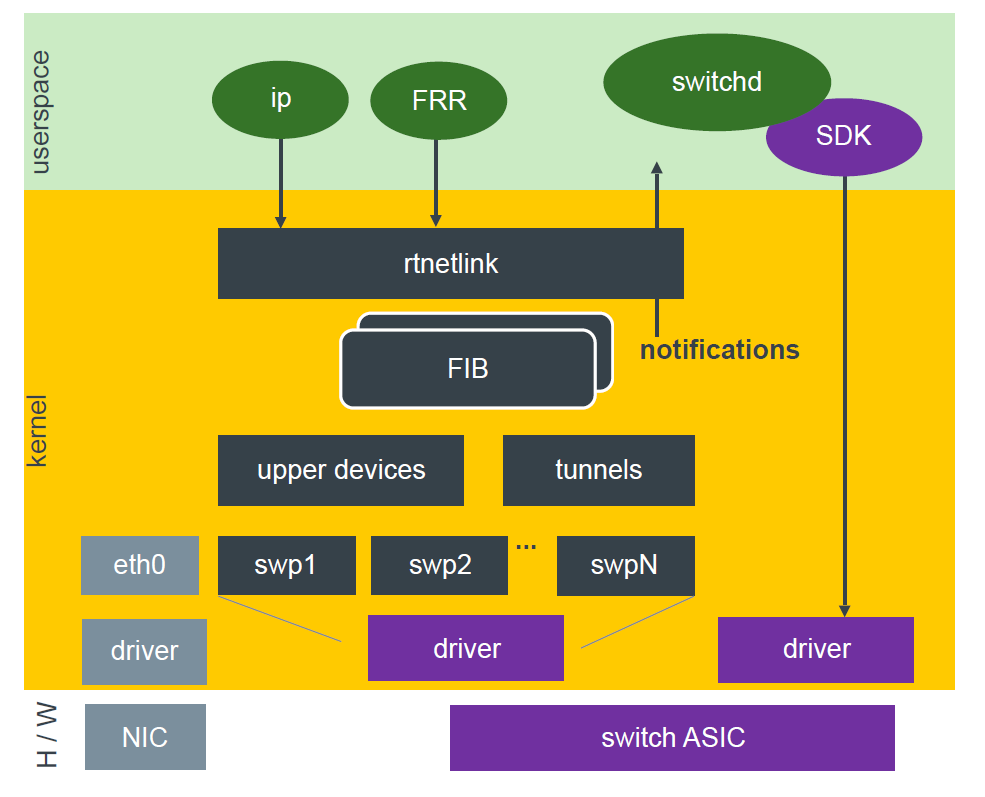

# Linux Netlink

> 特に言及がない場合は Linux v6.0 をベースに解説しています

Linux の netlink について解説します。
netlink を利用した ip route 設定の具体例は、別ページ [netlink/rtnetlink - Next Hop Object & Next Hop Group](./netlink-nexthop.md) にて解説しています。

- [netlink とは？](#netlink-とは)
- [netlink/rtnetlink を学習するモチベーション](#netlinkrtnetlink-を学習するモチベーション)
- [netlink message のフォーマット](#netlink-message-のフォーマット)
  - [Routing message attributes `RTA_*`](#routing-message-attributes-rta_)
  - [Next Hop Attribute `NHA_*`](#next-hop-attribute-nha_)
- [iproute2](#iproute2)
- [References](#references)


## netlink とは？

netlink とは、 Linux Kernel と情報のやり取りをするために利用されるインタフェース（API）、もしくはそれを提供するサブシステムです。
netlink は Socket を利用するため、TCP/UDP等の Socket プログラミングに馴染みある技術者であれば学習コストが少ないというメリットもあります。

netlink はプロトコル `protocol` と呼ばれる機能毎にグルーピングされます。
今回解説する IP Routing / Neighbor に関連した機能は `rtnetlink` と呼ばれ `protocol == NETLINK_ROUTE` という分類に所属します。

netlink を利用するためには、socket システムコール `int socket(int domain, int type, int protocol)` の第一引数に `AF_NETLINK` 、第二引数に `SOCK_RAW`、第三引数に `protocol` を指定します。

```
fd = socket(AF_NETLINK, SOCK_RAW, NETLINK_ROUTE);
```

## netlink/rtnetlink を学習するモチベーション

White Box Switch 等の上で動作する Network OS は、 netlinkを利用して様々な情報をホストOSや routing application （OSPF/ISIS/BGPの機能を提供するプロセスやコンテナ） から情報を受け取る場合も多く、Linux Server だけでなくスイッチやルータの実装を知るためにも重要な機能です。
例えば SONiC では、netlink を利用して Linux Kernel からポートやネイバーの情報を取得する他にも、FRR が動作する bgp container 内では FPM (Forwarding Plane Manager) との通信にも利用されています。

そのため、ネットワークに関連した幅広い技術者にとって学ぶべき基本的な技術と考えられます。


図：ネットリンクを活用している NOS の例  
（引用：Linux Plumbers Conf 2019: David Ahern: [nexthop-objects-talk.pdf](https://lpc.events/event/4/contributions/434/attachments/251/436/nexthop-objects-talk.pdf)）




## netlink message のフォーマット

netlink では `nlmsg_type` (netlink message type) でメッセージの種類を指定し、その後にメッセージタイプに応じたメッセージ（`rtmsg` `nhmsg` 等）、Netlink Attribute と続きます。

図：netlink message 概要 TODO

例えば、ip route の設定（追加）では `nlmsg_type` として `RTM_NEWROUTE` や `RTM_NEWNEXTHOP` を利用します。
それぞれのメッセージは以下 `struct rtmsg` `struct nhmsg` 構造体で規定されたフォーマットを取り、それに続く Attribute として Routing Message Attributes `RTA_*` や Next Hop Attributes `NHA_*` を利用します。

| nlmsg_type     | message 構造体 | netlink attr |
| -------------- | -------------- | ------------ |
| RTM_NEWROUTE   | struct rtmsg   | RTA_*        |
| RTM_NEWNEXTHOP | struct nhmsg   | NHA_*        |


```c
// include/uapi/linux/rtnetlink.h
struct rtmsg {
    unsigned char       rtm_family;
    unsigned char       rtm_dst_len;
    unsigned char       rtm_src_len;
    unsigned char       rtm_tos;

    unsigned char       rtm_table;  /* Routing table id */
    unsigned char       rtm_protocol;   /* Routing protocol; see below  */
    unsigned char       rtm_scope;  /* See below */
    unsigned char       rtm_type;   /* See below    */

    unsigned        rtm_flags;
};
```

```c
// include/uapi/linux/nexthop.h
struct nhmsg {
    unsigned char   nh_family;
    unsigned char   nh_scope;     /* return only */
    unsigned char   nh_protocol;  /* Routing protocol that installed nh */
    unsigned char   resvd;
    unsigned int    nh_flags;     /* RTNH_F flags */
};
```

### Routing message attributes `RTA_*`

Netlink Message `RTM_NEWROUTE` 等に含まれる Routing Message Attributes `RTA_*` の主なものについて、その意味を以下に記載します。


|     RTA_*      |  Value Type   |        値        | 説明                                                |
| :------------: | :-----------: | :--------------: | :-------------------------------------------------- |
|    RTA_DST     |               |                  | 宛先アドレス。 rtm_family に応じて Type が変わる    |
|    RTA_OIF     |    NLA_U32    |   ID (device)    | 送信先インターフェース                              |
|  RTA_GATEWAY   | NLA_U32, etc. |                  | Gateway のアドレス：IPv4(NLA_32), IPv6(???)         |
| RTA_MULTIPATH  | NLA_NESTED    | rtnexthop の配列 | (rtnexthop + RTA_GATEWAY) の配列                  |
|   RTA_TABLE    |    NLA_U32    |    ID (table)    | route が属するテーブル                              |
| RTA_ENCAP_TYPE |    NLA_U16    |                  | lwt encap type                                      |
|   RTA_ENCAP    |  NLA_NESTED   |                  | lwt encap data                                      |
|   RTA_NH_ID    |    NLA_U32    |   ID (nexthop)   | RTM_NEWNEXTHOP 等で作成された Next Hop Object の ID |

- `RTA_*` の完全な一覧は `enum rtattr_type_t` の定義を参照
  - https://elixir.bootlin.com/linux/v6.0/source/include/uapi/linux/rtnetlink.h#L360
- `RTA_*` は `rtm_family` などのコンテキスト毎に Type が変化するものが存在
  - `NHA_*` と異なり、`nla_policy` で Type 等が規定されていないものが見受けられるため、どのような型を取るかはコンテキスト毎に要確認
- `rtmsg rtm_table` や `RTA_TABLE` で利用される route table の一覧は `cat /etc/iproute2/rt_tables` から取得可能

RTA_MULTIPATH に含まれる rtnexthop 構造体。
この Attribute として RTA_GATEWAY が続く。

```c
// include/uapi/linux/rtnetlink.h
struct rtnexthop {
    unsigned short      rtnh_len;
    unsigned char       rtnh_flags;
    unsigned char       rtnh_hops;
    int         rtnh_ifindex;
};
```

参考：RTA_MULTIPATH の例。RTA_NH_ID が

```
NlMsghdr | Len:88, Type:RTM_NEWROUTE, Flags:600, Seq:1669611617, Pid:167576
rtmsg: {2 32 0 0 254 3 0 1 0}
rtmsg: RtMsg |
  Family:   AF_INET (2)
  Dst_len:  32
  Src_len:  0
  Tos:      0
  Table:    254
  Protocol: RTPROT_BOOT (3)
  Scope:    RT_SCOPE_UNIVERSE (0)
  Type:     RTN_UNICAST (1)
  Flags:    0
RtAttr | Len:8, Type:RTA_TABLE, Value:254
RtAttr | Len:8, Type:RTA_DST, IPv4:10.11.12.13
RtAttr | Len:8, Type:RTA_NH_ID, Value:3
RtAttr | Len:36, Type:RTA_MULTIPATH
  | rtnexthop: Len:16, Flags:0, Hops:0, Ifindex:5
  | RTA: Len:8, Type:RTA_GATEWAY, IPv4:172.20.105.172
  | rtnexthop: Len:16, Flags:0, Hops:0, Ifindex:5
  | RTA: Len:8, Type:RTA_GATEWAY, IPv4:172.20.105.173
```

### Next Hop Attribute `NHA_*`

Netlink Message `RTM_NEWNEXTHOP` 等に含まれる Next Hop Attribute `NHA_*` とその意味を以下に記載します。


|     NHA_*      | Value Type |         値         | 説明                                                                             |
| :------------: | :--------: | :----------------: | :------------------------------------------------------------------------------- |
|     NHA_ID     |  NLA_U32   |    ID (nexthop)    | id == 0 の場合は自動採番（auto-assign）                                          |
|   NHA_GROUP    | NLA_BINARY | nexthop_grp の配列 | nexthop_grp には nexthop id, wright が含まれる [1]                               |
| NHA_GROUP_TYPE |  NLA_U16   |  NEXTHOP_GRP_TYPE  | NHA_GROUP が存在する場合、この attribute のみ利用可能                            |
| NHA_BLACKHOLE  |  NLA_FLAG  |         -          | OIF, GATEWAY, ENCAP と同時利用は不可                                             |
|    NHA_OIF     |  NLA_U32   |    ID (device)     | dump で特定の device を使用する nexthop のみを返信するよう指定可能               |
|  NHA_GATEWAY   | NLA_BINARY |   be32, in6_addr   | Gateway のアドレス： IPv4(be32) もしくは IPv6(in6_addr)                          |
| NHA_ENCAP_TYPE |  NLA_U16   |        TODO        | lwt encap type                                                                   |
|   NHA_ENCAP    | NLA_NESTED |        TODO        | lwt encap data                                                                   |
|   NHA_GROUPS   |  NLA_FLAG  |         -          | dump で nexthop group のみを返信するよう指定                                     |
|   NHA_MASTER   |  NLA_U32   |  ID (master dev)   | dump で master dev に所属する nexthop のみ返信するよう指定                       |
|    NHA_FDB     |  NLA_FLAG  |         -          | nexthop が bridge fdb に所属する事を示す。OIF, BLACKHOLE, ENCAP と同時利用は不可 |
| NHA_RES_GROUP  | NLA_NESTED |        TODO        | resilient nexthop group attributes                                               |
| NHA_RES_BUCKET | NLA_NESTED |        TODO        | nexthop bucket attributes                                                        |


- "説明" は `include/uapi/linux/nexthop.h` のコメント記載された内容の和訳サマリ
- "Value Type" は値の型に関する指定
  - 値以外にも、長さや最初に存在すべき Attribute など、満たすべき条件に関する情報は `rtm_nh_policy_new` に定義されている
  - `rtm_nh_policy_new` 等、 `static struct nla_policy xxx[]`の型を持つ配列は netlink attribute 毎に定義されており validation に利用される
  - `NLA_U32` 等、各条件の意味に関しては `include/net/netlink.h` の `struct nla_policy` に関するコメントに詳細が記載されている
  - https://elixir.bootlin.com/linux/v6.0/source/include/net/netlink.h#L208
- NEXTHOP_GRP_TYPE は以下２種類
  - NEXTHOP_GRP_TYPE_MPATH ... Hash/Threshold タイプのNHG（指定無い場合のデフォルト値）
  - NEXTHOP_GRP_TYPE_RES ... Resilient Nexthop Group（別途解説予定）
- NHA_RES_GROUP, NHA_RES_BUCKET は Resilient Nexthop Group に関連した Attribute

[1] 参考： `NHA_GROUP` の Value の定義

```c
// include/uapi/linux/nexthop.h
/* entry in a nexthop group */
struct nexthop_grp {
    __u32   id;   /* nexthop id - must exist */
    __u8    weight;   /* weight of this nexthop */
    __u8    resvd1;
    __u16   resvd2;
};
```

## iproute2

rtnetlink を多用するツールとして iproute2 が挙げられます。
iproute2 の中の ip コマンドを用いて、netlink がどのように利用されているか見る事ができます。

例えば以下例では、netlink を用いて static route を追加しています。

- `sendmsg`
  - type=RTM_NEWROUTE
  - rtm_family=AF_INET, rtm_dst_len=32
  - {nla_len=8, nla_type=RTA_DST}, inet_addr("10.10.10.10")}
  - {nla_len=8, nla_type=RTA_GATEWAY}, inet_addr("172.20.105.174")

```
# strace ip route add 10.10.10.10/32 via 172.20.105.174 dev eno1
...
socket(AF_NETLINK, SOCK_RAW|SOCK_CLOEXEC, NETLINK_ROUTE) = 3
...
bind(3, {sa_family=AF_NETLINK, nl_pid=0, nl_groups=00000000}, 12) = 0
...
sendmsg(3, {msg_name={sa_family=AF_NETLINK, nl_pid=0, nl_groups=00000000}, msg_namelen=12, msg_iov=[{iov_base={{len=52, type=RTM_NEWROUTE, flags=NLM_F_REQUEST|NLM_F_ACK|NLM_F_EXCL|NLM_F_CREATE, seq=1669630667, pid=0}, {rtm_family=AF_INET, rtm_dst_len=32, rtm_src_len=0, rtm_tos=0, rtm_table=RT_TABLE_MAIN, rtm_protocol=RTPROT_BOOT, rtm_scope=RT_SCOPE_UNIVERSE, rtm_type=RTN_UNICAST, rtm_flags=0}, [{{nla_len=8, nla_type=RTA_DST}, inet_addr("10.10.10.10")}, {{nla_len=8, nla_type=RTA_GATEWAY}, inet_addr("172.20.105.174")}, {{nla_len=8, nla_type=RTA_OIF}, if_nametoindex("eno1")}]}, iov_len=52}], msg_iovlen=1, msg_controllen=0, msg_flags=0}, 0) = 52
```

## References

- [Kernel Korner - Why and How to Use Netlink Socket](https://www.linuxjournal.com/article/7356)
- [Blog: Debugging netlink requests](https://jvns.ca/blog/2017/09/03/debugging-netlink-requests/)
- [sock_diag(7) — Linux manual page](https://man7.org/linux/man-pages/man7/sock_diag.7.html)
- [Qiita: netlinkファンのためのnlmon](https://qiita.com/kwi/items/991c3bd01889db45307e)
- [Blog: Taming Netlink](https://dtucker.co.uk/blog/taming-netlink/)
  - How to debug netlink using iproute2, strace, nltrace
- [https://github.com/ebiken/doc-network/wiki/](https://github.com/ebiken/doc-network/wiki/Linux-Basics-:-NETLINK)
  - old and incomplete personal memo about netlink
- tcptrack
  - [github source (C++)](https://github.com/bchretien/tcptrack)
  - [ubuntu manpage](https://manpages.ubuntu.com/manpages/focal/man1/tcptrack.1.html)
- [Blog: 2022-01-11 Netlinkプログラミングの書き方](https://hana-shin.hatenablog.com/entry/2022/01/11/212403)
- [gwind/go-netlink-socket-monitor.go](https://gist.github.com/gwind/05f5f649d93e6015cf47ffa2b2fd9713)
- [Parsing the RTA_MULTIPATH attribute from Rtnetlink Jan 25, 2018](https://ederlf.website/post/netlink-multipath/)
- [gist: cl4u2: Linux route monitoring example](https://gist.github.com/cl4u2/5204374)
  - Example code (including `route_monitor.c`)


