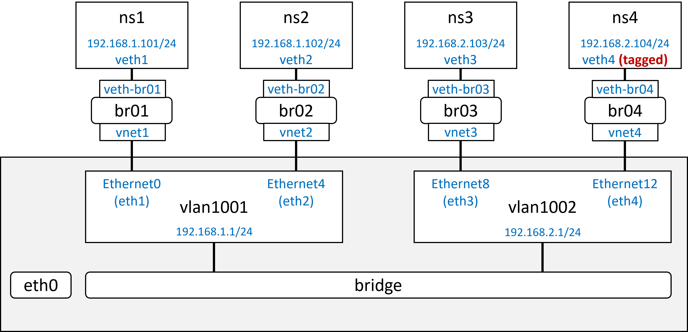
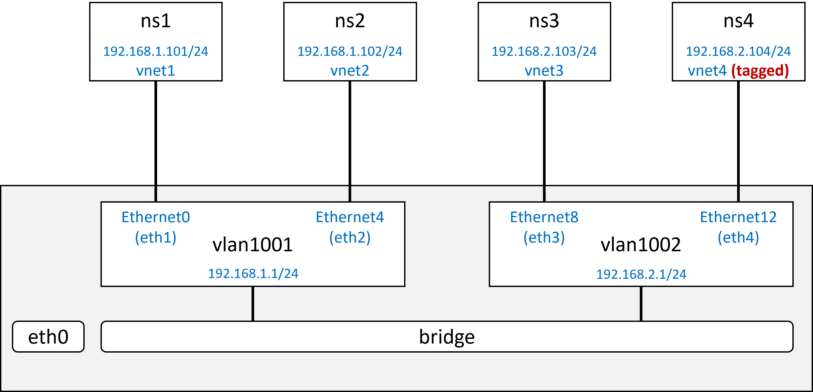

# Running SONiC on KVM (sonic-vs)

プロトコルや各モジュールの自動テストやデモなど、データプレーンを必要としない用途では KVM 版 SONiC が便利である。

本ページでは、SONiC on KVM の仮想マシン作成＆起動方法、及び [SONiC on KVM 設定例](#sonic-on-kvm-設定例) を通じた利用方法の解説をメモする。

Table of Contents
- [KVM版の機能制約](#kvm版の機能制約)
- [Setup KVM](#setup-kvm)
- [SONiC on KVM の起動](#sonic-on-kvm-の起動)
  - [1. SONiC Image (`sonic-vs`) の入手やビルド](#1-sonic-image-sonic-vs-の入手やビルド)
  - [2. KVM (libvirt) ドメイン設定ファイル `sonic.xml` の編集](#2-kvm-libvirt-ドメイン設定ファイル-sonicxml-の編集)
  - [3. SONiC VM（仮想マシン）の起動とログイン](#3-sonic-vm仮想マシンの起動とログイン)
    - [VMの作成、起動](#vmの作成起動)
    - [VMの停止（削除）](#vmの停止削除)
    - [ログイン：コンソール (telnet, virsh console)](#ログインコンソール-telnet-virsh-console)
    - [ログイン： SSH](#ログイン-ssh)
    - [パスワードの変更（オプション）](#パスワードの変更オプション)
- [SONiC on KVM 設定例](#sonic-on-kvm-設定例)
  - [demo01: Layer 2/3 with VLAN (type=bridge)](#demo01-layer-23-with-vlan-typebridge)
  - [demo02: Layer 2/3 with VLAN (type=network)](#demo02-layer-23-with-vlan-typenetwork)
- [libvirt Domain XML format オプション](#libvirt-domain-xml-format-オプション)
  - [sonic.xml Interface Type](#sonicxml-interface-type)
  - [VM情報の確認](#vm情報の確認)


## KVM版の機能制約

パケット転送性能以外の機能的な制約（出来ない事）

- `show interfaces counters` がカウントされない
- （他にも気付いたら追加する）

## Setup KVM

> Ubuntu 20.04.4 で確認

- 参考：[How to Install Kvm on Ubuntu 20.04](https://linuxize.com/post/how-to-install-kvm-on-ubuntu-20-04/)

```
$ sudo apt update
$ sudo apt install cpu-checker
```

ホストが KVM に対応しているか確認

```
> check the server is capable to run KVM
$ kvm-ok
INFO: /dev/kvm exists
KVM acceleration can be used
```

KVM のインストール

```
> Install KVM
$ sudo apt install qemu-kvm libvirt-daemon-system libvirt-clients bridge-utils virtinst virt-manager
$ sudo systemctl is-active libvirtd
active
```

ユーザを libvirt & kvm グループに追加

```
> Add user to libvirt and kvm groups.
sudo usermod -aG libvirt $USER
sudo usermod -aG kvm $USER
```

bridge 設定の確認

```
> Check bridge config
$ brctl show
bridge name     bridge id               STP enabled     interfaces
docker0         8000.02427a6148d4       no              veth580bcd4
virbr0          8000.52540033c220       yes             virbr0-nic

$ bridge link
449: virbr0-nic: <BROADCAST,MULTICAST> mtu 1500 master virbr0 state disabled priority 32 cost 100
```

## SONiC on KVM の起動

起動までの手順

1. SONiC Switch Image の入手やビルド
2. KVM (libvirt) 設定ファイルの編集
3. SONiC VM（仮想マシン）の起動

### 1. SONiC Image (`sonic-vs`) の入手やビルド

- 入手やビルド方法は [SONiC Switch Image](sonic-image.md) を参照

Unzip するのを忘れずに。

```
$ gunzip xvf sonic-vs.img.gz
$ ls
sonic-vs.img
```

### 2. KVM (libvirt) ドメイン設定ファイル `sonic.xml` の編集

- `sonic.xml` のオフィシャルなサンプルは [GitHub: Azure/sonic-buildimage](https://github.com/Azure/sonic-buildimage/blob/master/platform/vs/sonic.xml) から入手可能。
- 様々な構成毎の設定サンプル [SONiC on KVM 設定例]() や、各設定の意味 [libvirt Domain XML format オプション]() は後述
- 必須の編集項目は、以下 Switch Image の場所指定 `<source file/>`

```
<source file='/data/sonic/sonic-buildimage/target/sonic-vs.img'/>

# 以下のように環境に合わせてパスやファイル名を変更
<source file='/var/lib/libvirt/images/20220519.5.sonic-vs.img'/>
```

### 3. SONiC VM（仮想マシン）の起動とログイン

#### VMの作成、起動

```
> Create and Start SONiC Virtual Switch (KVM)

nsdevnotes/sonic/examples$ virsh create sonic.xml

$ virsh list --all
 Id   Name    State
-----------------------
 25   sonic   running
```

#### VMの停止（削除）

```
$ virsh destroy sonic

$ virsh list --all
 Id   Name   State
--------------------
```

#### ログイン：コンソール (telnet, virsh console)

> デフォルトの userid / password => `admin` / `YourPaSsWoRd`

- コンソールへのアクセス方法は telnet と virsh console の２通り。
- 利用したい方法で sonic.xml の `<devices><serial type>` を編集
  - 注：両方記載すると先に記述されている方になる

telnet でアクセス

```
> Access console via telnet
> sonic.xml の編集
    <serial type='tcp'>
      <source host='127.0.0.1' mode='bind' service='7000'/>
      <target port='0'/>
      <protocol type='telnet'/>
    </serial>

$ telnet localhost 7000

> ctrl+] ctrl+d で接続解除
```

vish console でアクセス

```
> Access console via virsh console
> sonic.xml の編集
    <serial type="pty">
      <source path="/dev/pts/3"/>
      <target port="1"/>
    </serial>

$ virsh console sonic
```

#### ログイン： SSH

- コンソール経由で SONiC にログイン
  - DHCPでアドレスのアサイン： `sudo dhclient -v`
  - 管理アドレスの確認： `ip a show eth0`
- ホストから SONiC eth0 に接続
  - SSHで接続: `sudo admin@<eth0-address>` `ssh admin@192.168.122.169`

> 一般的には、最初のインターフェースである `eth0` が管理インターフェースとなる

#### パスワードの変更（オプション）

- SONiC VM内部で `sudo passwd admin` -> 新しいパスワードを２回入力


## SONiC on KVM 設定例

スクリプトで起動可能なデモを通じた、設定方法や利用方法の解説メモ。（スクリプトや設定ファイルは `examples/` に保存）

- [demo01: Layer 2/3 with VLAN (type=bridge)](#demo01-layer-23-with-vlan-typebridge)
  - libvirt domain 設定（sonic.xml） で `<interface type='bridge'>` を利用したサンプル
  - ホスト側に bridge & veth pair を作成する必要があるため、netns をホストと見立てたテストには煩雑
  - 逆に、スイッチやルーターの仮想インスタンスを接続する場合には有用な方式
- [demo02: Layer 2/3 with VLAN (type=network)](#demo02-layer-23-with-vlan-typenetwork)
  - libvirt domain 設定（sonic.xml） で `<interface type='network'>` を利用したサンプル
  - ホスト側に bridge & veth pair 設定が不要なため、netns をホストと見立てたテストを簡単に実施可能

### demo01: Layer 2/3 with VLAN (type=bridge)

- Interface Type: `<interface type='bridge'>`



（ホスト）VM Interface の接続先(`source bridge`)となる bridge を作成し、ホストとみなした netns や veth pair を作成

```
$ cd nsdevnotes/sonic/examples
$ sudo ./nssetup-demo01-bridge.sh -c
```

（ホスト）SONiC VM の作成

```
$ cd nsdevnotes/sonic/examples
nsdevnotes/sonic/examples$ virsh create sonic-demo01-bridge.xml
```

（SONiC）config_db.json を変更し設定のリロード

```
> ホストのファイルを scp や git clone してコピー
admin@sonic:/etc/sonic$ sudo cp config_db.demo01-02.json config_db.json

admin@sonic:/etc/sonic$ sudo config reload
Clear current config and reload config in config_db format from the default config file(s) ? [y/N]: y
Running command: rm -rf /tmp/dropstat-*
Disabling container monitoring ...
Stopping SONiC target ...
```

（SONiC）L2 Switching のためには `ebtables -F` が必要

```
admin@sonic:~$ sudo ebtables -F
```

（ホスト） Ping による疎通確認

```
>>> L2 fowrading: vlan1001

$ sudo ip netns exec ns1 ping 192.168.1.102
PING 192.168.1.102 (192.168.1.102) 56(84) bytes of data.
64 bytes from 192.168.1.102: icmp_seq=1 ttl=64 time=2.19 ms
64 bytes from 192.168.1.102: icmp_seq=2 ttl=64 time=0.738 ms

$ sudo ip netns exec ns2 ping 192.168.1.101
PING 192.168.1.101 (192.168.1.101) 56(84) bytes of data.
64 bytes from 192.168.1.101: icmp_seq=1 ttl=64 time=0.835 ms
64 bytes from 192.168.1.101: icmp_seq=2 ttl=64 time=0.550 ms

>>> L2 fowrading: vlan1002 (ns4 is tagged)

$ sudo ip netns exec ns3 ping 192.168.2.104
PING 192.168.2.104 (192.168.2.104) 56(84) bytes of data.
64 bytes from 192.168.2.104: icmp_seq=1 ttl=64 time=0.829 ms
64 bytes from 192.168.2.104: icmp_seq=2 ttl=64 time=0.751 ms

$ sudo ip netns exec ns4 ping 192.168.2.103
PING 192.168.2.103 (192.168.2.103) 56(84) bytes of data.
64 bytes from 192.168.2.103: icmp_seq=1 ttl=64 time=1.88 ms
64 bytes from 192.168.2.103: icmp_seq=2 ttl=64 time=0.645 ms

>> L3 forwarding
$ sudo ip netns exec ns2 ping 192.168.2.104
PING 192.168.2.104 (192.168.2.104) 56(84) bytes of data.
64 bytes from 192.168.2.104: icmp_seq=1 ttl=63 time=1.44 ms
64 bytes from 192.168.2.104: icmp_seq=2 ttl=63 time=0.610 ms

$ sudo ip netns exec ns4 ping 192.168.1.101
PING 192.168.1.101 (192.168.1.101) 56(84) bytes of data.
64 bytes from 192.168.1.101: icmp_seq=1 ttl=63 time=0.832 ms
64 bytes from 192.168.1.101: icmp_seq=2 ttl=63 time=0.690 ms
```

参考情報

```
$ virsh domiflist sonic
 Interface   Type      Source    Model    MAC
-------------------------------------------------------------
 vnet0       network   default   virtio   52:54:00:11:22:00
 vnet1       bridge    br01      virtio   52:54:00:11:22:01
 vnet2       bridge    br02      virtio   52:54:00:11:22:02
 vnet3       bridge    br03      virtio   52:54:00:11:22:03
 vnet4       bridge    br04      virtio   52:54:00:11:22:04

admin@sonic:~$ show vlan brief
+-----------+----------------+------------+----------------+-------------+-----------------------+
|   VLAN ID | IP Address     | Ports      | Port Tagging   | Proxy ARP   | DHCP Helper Address   |
+===========+================+============+================+=============+=======================+
|      1001 | 192.168.1.1/24 | Ethernet0  | untagged       | disabled    |                       |
|           |                | Ethernet4  | untagged       |             |                       |
+-----------+----------------+------------+----------------+-------------+-----------------------+
|      1002 | 192.168.2.1/24 | Ethernet8  | untagged       | disabled    |                       |
|           |                | Ethernet12 | tagged         |             |                       |
+-----------+----------------+------------+----------------+-------------+-----------------------+

admin@sonic:~$ show vlan config
Name        VID  Member      Mode
--------  -----  ----------  --------
Vlan1001   1001  Ethernet0   untagged
Vlan1001   1001  Ethernet4   untagged
Vlan1002   1002  Ethernet8   untagged
Vlan1002   1002  Ethernet12  tagged

admin@sonic:~$ show mac
  No.    Vlan  MacAddress         Port       Type
-----  ------  -----------------  ---------  -------
    1    1001  4E:5F:27:E6:6D:E9  Ethernet0  Dynamic
    2    1001  16:14:AC:40:0B:03  Ethernet4  Dynamic
    3    1001  66:B1:23:EB:93:E8  Ethernet0  Dynamic
    4    1001  0A:B8:43:EE:FD:1C  Ethernet4  Dynamic
    5    1002  DA:E8:20:CC:CF:3E  Ethernet8  Dynamic
    6    1002  4A:F4:A7:DE:B7:8A  Ethernet8  Dynamic
Total number of entries 6
```

### demo02: Layer 2/3 with VLAN (type=network)

- Interface Type: `<interface type='network'>`



（ホスト）SONiC VM 及び netns の作成

```
nsdevnotes/sonic/examples$ virsh create sonic-demo02-network.xml

> vnet0 ~ vnet4 が作成されたことを確認
$ ip a | grep vnet
718: vnet0: <BROADCAST,MULTICAST,UP,LOWER_UP> mtu 1500 qdisc fq_codel master virbr0 state UNKNOWN group default qlen 1000
719: vnet1: <BROADCAST,MULTICAST,UP,LOWER_UP> mtu 1500 qdisc fq_codel master virbr0 state UNKNOWN group default qlen 1000
720: vnet2: <BROADCAST,MULTICAST,UP,LOWER_UP> mtu 1500 qdisc fq_codel master virbr0 state UNKNOWN group default qlen 1000
721: vnet3: <BROADCAST,MULTICAST,UP,LOWER_UP> mtu 1500 qdisc fq_codel master virbr0 state UNKNOWN group default qlen 1000
722: vnet4: <BROADCAST,MULTICAST,UP,LOWER_UP> mtu 1500 qdisc fq_codel master virbr0 state UNKNOWN group default qlen 1000

nsdevnotes/sonic/examples$ sudo ./nssetup-demo02-network.sh -c

> ns1 ~ ns4 が作成されたことを確認
$ ip netns
ns4 (id: 3)
ns3 (id: 2)
ns2 (id: 1)
ns1 (id: 0)

$ sudo ip netns exec ns1 ip a show vnet1
719: vnet1: <BROADCAST,MULTICAST,UP,LOWER_UP> mtu 1500 qdisc fq_codel state UNKNOWN group default qlen 1000
    link/ether fe:54:00:11:22:01 brd ff:ff:ff:ff:ff:ff
    inet 192.168.1.101/24 scope global vnet1
       valid_lft forever preferred_lft forever
    inet6 fe80::fc54:ff:fe11:2201/64 scope link
       valid_lft forever preferred_lft forever
```

（SONiC）config_db.json を変更し設定のリロード

```
> ホストのファイルを scp や git clone してコピー
admin@sonic:/etc/sonic$ sudo cp config_db.demo01-02.json config_db.json

admin@sonic:/etc/sonic$ sudo config reload
Clear current config and reload config in config_db format from the default config file(s) ? [y/N]: y
Running command: rm -rf /tmp/dropstat-*
Disabling container monitoring ...
Stopping SONiC target ...
```

（SONiC）L2 Switching のためには `ebtables -F` が必要

```
admin@sonic:~$ sudo ebtables -F
```

（ホスト）疎通確認

```
>> ns1 から ns3 への Ping
$ sudo ip netns exec ns1 ping 192.168.2.103
PING 192.168.2.103 (192.168.2.103) 56(84) bytes of data.
64 bytes from 192.168.2.103: icmp_seq=1 ttl=63 time=1.50 ms
64 bytes from 192.168.2.103: icmp_seq=2 ttl=63 time=0.695 ms
```

参考情報

```
admin@sonic:~$ show vlan config
Name        VID  Member      Mode
--------  -----  ----------  --------
Vlan1001   1001  Ethernet0   untagged
Vlan1001   1001  Ethernet4   untagged
Vlan1002   1002  Ethernet8   untagged
Vlan1002   1002  Ethernet12  tagged

admin@sonic:~$ show vlan brief
+-----------+----------------+------------+----------------+-------------+-----------------------+
|   VLAN ID | IP Address     | Ports      | Port Tagging   | Proxy ARP   | DHCP Helper Address   |
+===========+================+============+================+=============+=======================+
|      1001 | 192.168.1.1/24 | Ethernet0  | untagged       | disabled    |                       |
|           |                | Ethernet4  | untagged       |             |                       |
+-----------+----------------+------------+----------------+-------------+-----------------------+
|      1002 | 192.168.2.1/24 | Ethernet8  | untagged       | disabled    |                       |
|           |                | Ethernet12 | tagged         |             |                       |
+-----------+----------------+------------+----------------+-------------+-----------------------+
```

## libvirt Domain XML format オプション

sonic.xml のオプションに関するメモ

### sonic.xml Interface Type

TODO: SONIC VM インターフェースの関係

- 管理インターフェースになるのはどれ？
- 最初のインターフェースがならないパターンにも遭遇（再現条件の切り分けが必要）

### VM情報の確認

- 参考：[20.12. Retrieving Information about Your Virtual Machine](https://access.redhat.com/documentation/en-us/red_hat_enterprise_linux/7/html/virtualization_deployment_and_administration_guide/sect-statlists)
  - RedHat, RHEL7 : VIRTUALIZATION DEPLOYMENT AND ADMINISTRATION GUIDE


```
> SONiC Switch Image の確認
$ virsh domblklist sonic
 Target   Source
-----------------------------------------------------------
 vda      /var/lib/libvirt/images/20220519.5.sonic-vs.img

> VM概要
$ virsh dominfo sonic
Id:             50
Name:           sonic
UUID:           bd637f44-5170-453c-bf68-9a7e6cf89752
OS Type:        hvm
State:          running
CPU(s):         1
CPU time:       81.7s
Max memory:     1953792 KiB
Used memory:    1953128 KiB
Persistent:     no
Autostart:      disable
Managed save:   no
Security model: apparmor
Security DOI:   0
Security label: libvirt-bd637f44-5170-453c-bf68-9a7e6cf89752 (enforcing)

> 設定XMLの表示
$ virsh dumpxml sonic
<domain type='kvm' id='50'>
  <name>sonic</name>
  <uuid>bd637f44-5170-453c-bf68-9a7e6cf89752</uuid>
  <memory unit='KiB'>1953792</memory>
  <currentMemory unit='KiB'>1953128</currentMemory>
  <vcpu placement='static'>1</vcpu>
  <resource>
    <partition>/machine</partition>
  </resource>
  <os>
    <type arch='x86_64' machine='pc-i440fx-1.5'>hvm</type>
    <boot dev='hd'/>
  </os>
...省略...

$ virsh domiflist sonic
 Interface   Type      Source    Model    MAC
-------------------------------------------------------------
 vnet0       network   default   virtio   52:54:00:11:22:00
 vnet1       network   default   virtio   52:54:00:11:22:01
 vnet2       network   default   virtio   52:54:00:11:22:02
 vnet3       network   default   virtio   52:54:00:11:22:03
 vnet4       network   default   virtio   52:54:00:11:22:04

 $ virsh domifstat sonic vnet0
vnet0 rx_bytes 23640
vnet0 rx_packets 423
vnet0 rx_errs 0
vnet0 rx_drop 0
vnet0 tx_bytes 11837
vnet0 tx_packets 68
vnet0 tx_errs 0
vnet0 tx_drop 27

```
